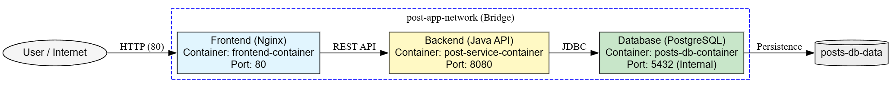
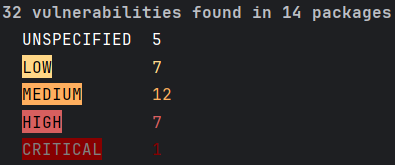
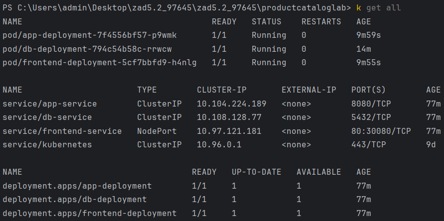

# Social Media Post Manager - System Mikrousługowy
Projekt budowy skonteneryzowanej aplikacji do zarządzania postami, realizowany w architekturze mikroserwisowej z naciskiem na bezpieczeństwo danych.

## Architektura Systemu
System składa się z trzech odseparowanych warstw:
1. **Frontend (Nginx)**: Interfejs użytkownika (Port 80).
2. **Backend (Java Spring Boot)**: REST API oraz Swagger UI (Port 8080).
3. **Database (PostgreSQL)**: Izolowany magazyn danych (Port 5432 - wewnętrzny).



## Bezpieczeństwo i Konfiguracja
### Kluczowe cechy wdrożenia:
* **Izolacja Bazy Danych**: PostgreSQL jest dostępny wyłącznie dla usługi backendowej wewnątrz sieci klastra.
* **Kubernetes Secrets**: Wrażliwe dane, takie jak hasła do bazy, są przechowywane w zaszyfrowanych obiektach Secret.
* **Resource Quotas**: Na poziomie klastra zdefiniowano limity zasobów CPU i RAM, chroniące infrastrukturę przed atakami typu DoS oraz błędami wyczerpania pamięci.
* **Strategia Aktualizacji**: Wykorzystano RollingUpdate z parametrem `maxUnavailable: 25%`, co gwarantuje wysoką dostępność usług podczas wdrażania zmian.

## Analiza Zagrożeń (Docker Scout)
Przeprowadzono audyt obrazu `app-service` pod kątem podatności.
Wyniki skanowania:
* **Wykryte podatności**: 32 (1 Critical, 7 High, 12 Medium, 7 Low).
* **Kluczowe ryzyko**: CVE-2026-32767 (Critical) w bibliotece `expat` oraz błędy w serwerze Tomcat.
* **Rekomendacja**: Aktualizacja obrazu bazowego do wersji `26-jre-alpine` w celu usunięcia luki krytycznej.



## Uruchomienie projektu
### Opcja A: Docker Compose
1. Zbuduj i uruchom aplikację: 
```bash
mvn clean package -DskipTests
docker compose up --build -d`
```
2. Aplikacja będzie dostępna pod adresem: 
- http://localhost:80

### Opcja B: Kubernetes 
1. Uruchom klaster (np. Minikube): 
```bash
minikube start --cni=calico
```
2. Załaduj lokalne obrazy do rejestru klastra:
```bash
minikube image load productcataloglab-app-service:latest
minikube image load productcataloglab-frontend-service:latest
```
3. Zaaplikuj manifest: 
```bash
kubectl apply -f manifest.yaml
```
4. Sprawdź status wdrożenia:
```bash
kubectl get all
```
**Wskazówka:** Jeśli lista zasobów jest pusta, mimo poprawnego wykonania `apply`, Twój kubectl może operować w innej przestrzeni nazw. Ustaw domyślny kontekst komendą:
```bash
kubectl config set-context --current --namespace=default
```
**Oczekiwany rezultat:** Wszystkie pody powinny mieć status Running, a serwisy poprawnie przypisane adresy IP i porty.

5. Uzyskaj dostęp do aplikacji:
```bash
minikube service frontend-service
```